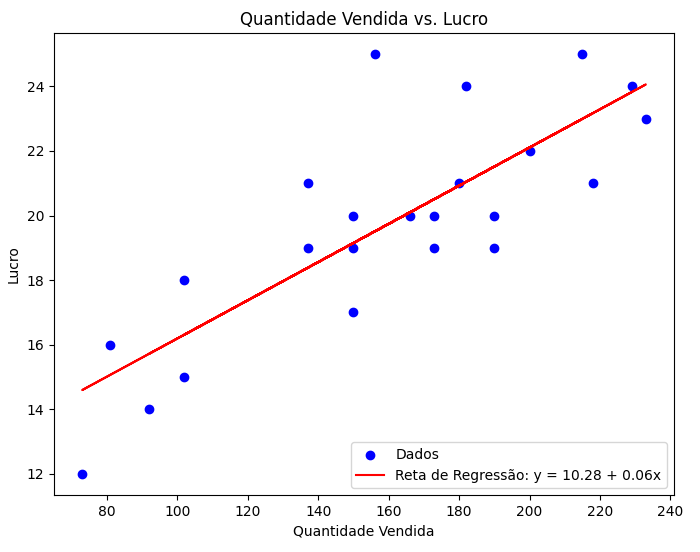
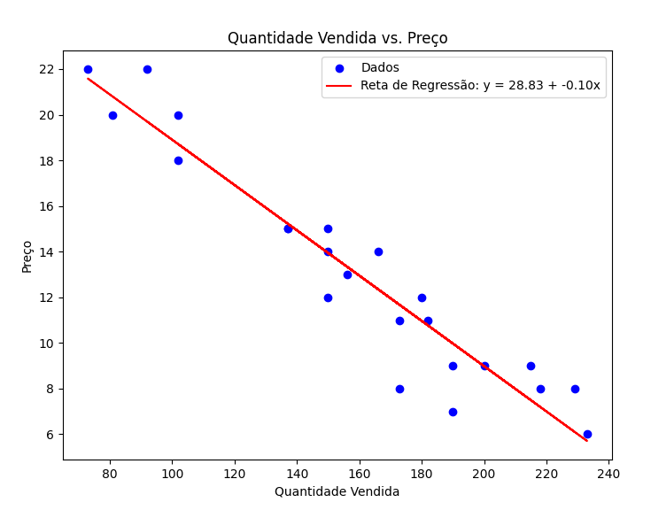
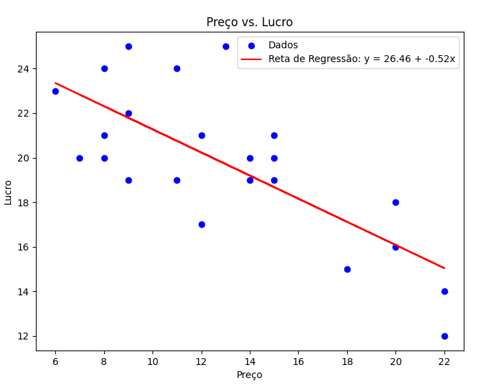

# 1

### **Ponto de Venda**

**Tipo**: Categórica nominal

### **Quantidade de Cosmético Vendido**

**Tipo**: Quantitativa discreta

### **Preço**

**Tipo**: Quantitativa discreta

### **Lucro**

**Tipo**: Quantitativa discreta

# 2

### Intervalos de Confiança

Para calcular os intervalos de confiança em torno da média amostral, usamos a fórmula:

$IC = \bar{x} \pm t \times EPM $

onde:

- $\bar{x}$ é a média amostral
- \(t\) é o valor crítico da distribuição t de Student para o nível de confiança desejado
- \(EPM\) é o erro padrão da média

### Quantidade Vendida

- **Média $\bar{x}$**: 177.35
- **Desvio Padrão (s)**: Aproximadamente 51.68
- **Número de Amostras (n)**: 23
- **Erro Padrão da Média (EPM)**:
  $
  EPM = \frac{51.68}{\sqrt{23}} \approx 10.74$
- **Valor Crítico \(t\)** (95% de confiança, 22 graus de liberdade): 2.074
- **Intervalo de Confiança**:
  \[$
  IC = 177.35 \pm 2.074 \times 10.74$
  \]
  \[
  $IC = 177.35 \pm 22.27$
  \]
  \[
  $IC \approx [155.08, 199.62]$
  \]

### Preço

- **Média ($\bar{x}$)**: 12.35
- **Desvio Padrão (s)**: Aproximadamente 3.57
- **Número de Amostras (n)**: 23
- **Erro Padrão da Média (EPM)**:
  \[$
  EPM = \frac{3.57}{\sqrt{23}} \approx 0.75$
  \]
- **Valor Crítico \(t\)** (95% de confiança, 22 graus de liberdade): 2.074
- **Intervalo de Confiança**:
  \[$
  IC = 12.35 \pm 2.074 \times 0.75$
  \]
  \[$
  IC = 12.35 \pm 1.56$
  \]
  \[$
  IC \approx [10.79, 13.91]$
  \]

### Lucro

- **Média ($\bar{x}$)**: 19.65
- **Desvio Padrão (s)**: Aproximadamente 3.52
- **Número de Amostras (n)**: 23
- **Erro Padrão da Média (EPM)**:
  \[$
  EPM = \frac{3.52}{\sqrt{23}} \approx 0.73$
  \]
- **Valor Crítico \(t\)** (95% de confiança, 22 graus de liberdade): 2.074
- **Intervalo de Confiança**:
  \[$
  IC = 19.65 \pm 2.074 \times 0.73$
  \]
  \[$
  IC = 19.65 \pm 1.52$
  \]
  \[$
  IC \approx [18.13, 21.17]$
  \]

### Resumo dos Intervalos de Confiança

- **Quantidade Vendida**: \([155.08, 199.62]\)
- **Preço**: \([10.79, 13.91]\)
- **Lucro**: \([18.13, 21.17]\)

# 3


# 4

## Retas de Regressão

### 1. Quantidade Vendida vs. Preço

A reta de regressão é dada pela equação:

$$ y = {interceptqv preco} + slopeqvpreco \cdot x $$



### 2. Quantidade Vendida vs. Lucro

A reta de regressão é dada pela equação:
$$y = intercept qv lucro + slope qv lucro \cdot x $$



### 3. Preço vs. Lucro

A reta de regressão é dada pela equação:

\[ $$y = intercept\_preco\_lucro + {slope\_preco\_lucro} \cdot x$$ \]



# 5

```
                            OLS Regression Results
==============================================================================
Dep. Variable:                  Lucro   R-squared:                       0.666
Model:                            OLS   Adj. R-squared:                  0.633
Method:                 Least Squares   F-statistic:                     19.93
Date:                Sun, 15 Sep 2024   Prob (F-statistic):           1.73e-05
Time:                        22:57:22   Log-Likelihood:                -47.668
No. Observations:                  23   AIC:                             101.3
Df Residuals:                      20   BIC:                             104.7
Df Model:                           2
Covariance Type:            nonrobust
======================================================================================
                         coef    std err          t      P>|t|      [0.025      0.975]
--------------------------------------------------------------------------------------
const                  3.3125      8.770      0.378      0.710     -14.982      21.607
Quantidade_Vendida     0.0831      0.031      2.667      0.015       0.018       0.148
Preço                  0.2417      0.299      0.808      0.429      -0.383       0.866
==============================================================================
Omnibus:                        6.832   Durbin-Watson:                   2.837
Prob(Omnibus):                  0.033   Jarque-Bera (JB):                4.588
Skew:                           0.973   Prob(JB):                        0.101
Kurtosis:                       4.002   Cond. No.                     3.40e+03
==============================================================================
```

# 6

```
                            OLS Regression Results
==============================================================================
Dep. Variable:                  Preço   R-squared:                       0.911
Model:                            OLS   Adj. R-squared:                  0.902
Method:                 Least Squares   F-statistic:                     102.5
Date:                Sun, 15 Sep 2024   Prob (F-statistic):           3.08e-11
Time:                        22:59:49   Log-Likelihood:                -40.595
No. Observations:                  23   AIC:                             87.19
Df Residuals:                      20   BIC:                             90.60
Df Model:                           2
Covariance Type:            nonrobust
======================================================================================
                         coef    std err          t      P>|t|      [0.025      0.975]
--------------------------------------------------------------------------------------
const                 27.4870      2.025     13.575      0.000      23.263      31.711
Quantidade_Vendida    -0.1070      0.012     -9.050      0.000      -0.132      -0.082
Lucro                  0.1307      0.162      0.808      0.429      -0.207       0.468
==============================================================================
Omnibus:                        2.944   Durbin-Watson:                   1.529
Prob(Omnibus):                  0.229   Jarque-Bera (JB):                1.637
Skew:                          -0.634   Prob(JB):                        0.441
Kurtosis:                       3.316   Cond. No.                     1.08e+03
==============================================================================
```
